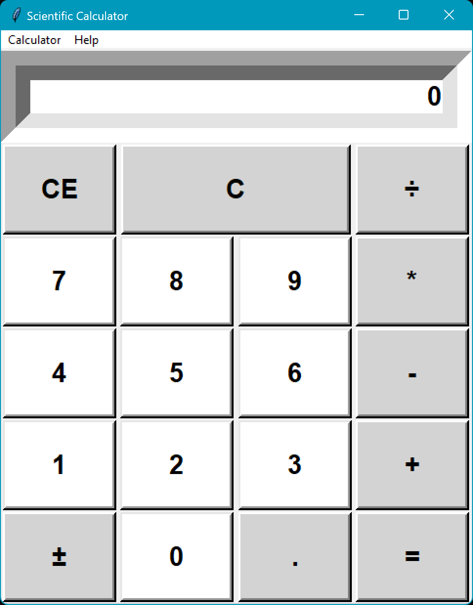
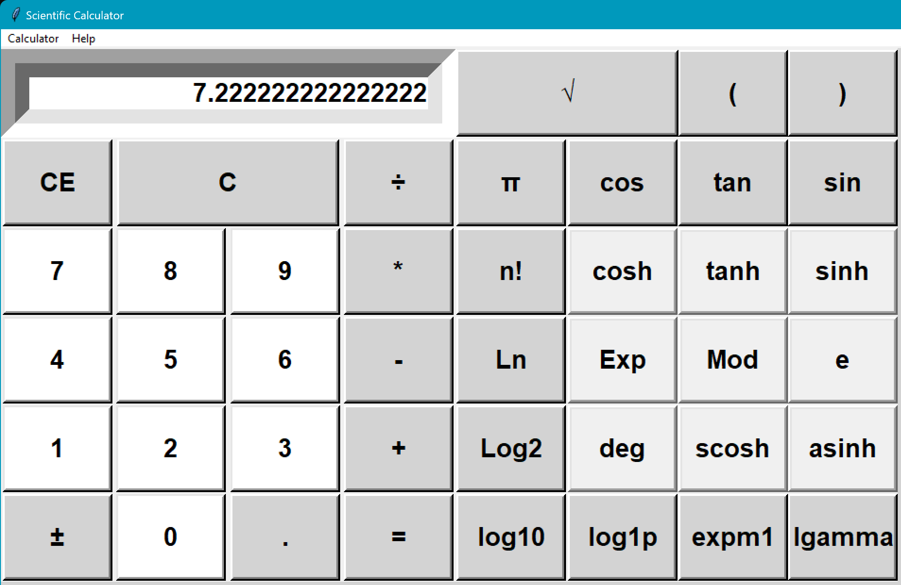

# Scientific Calculator

 

 <h2> Basic  </h2> 

 <h2> Scientific </h2> 

 
 

<h2>license:</h2>

Author: Bill Chamalidis

Copyright (c). All rights Reserved

This program is free software: you can redistribute it and/or modify
    it under the terms of the <a href="https://www.gnu.org/licenses/gpl-3.0.en.html">GNU</a> General Public License as published by
    the Free Software Foundation, either version 3 of the License, or
    any later version.

